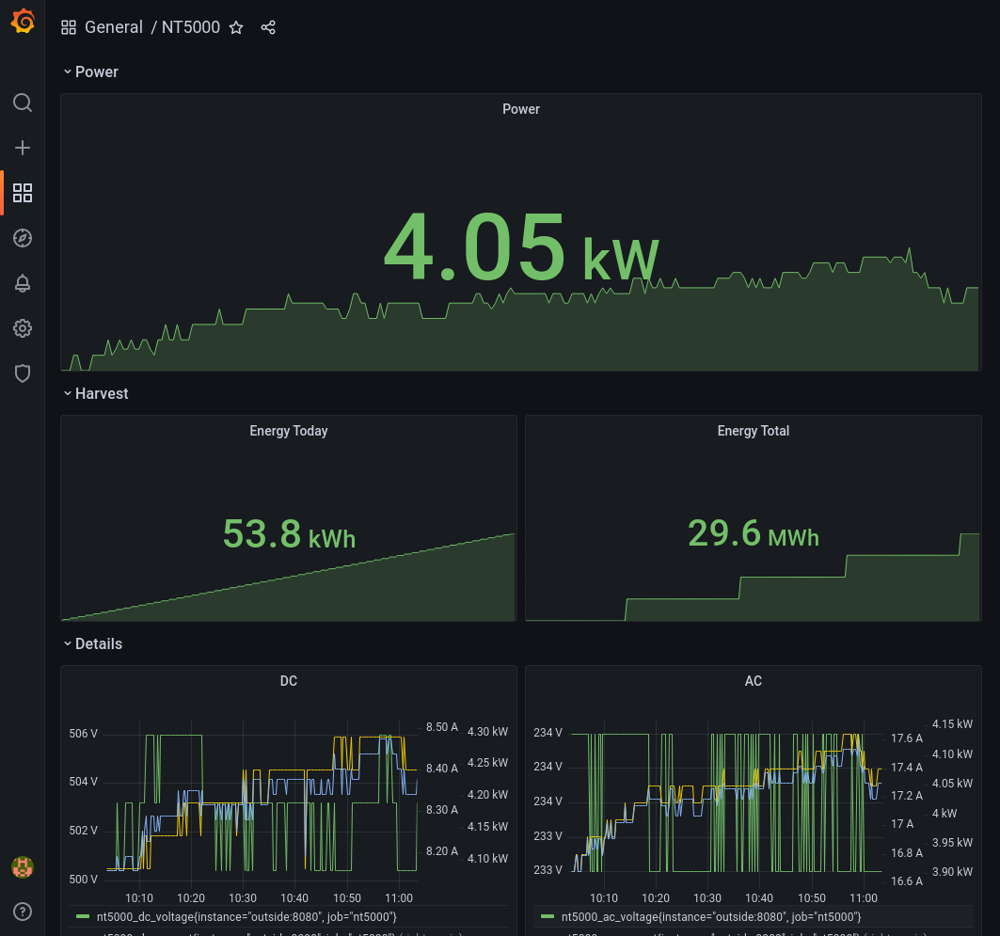

# nt5000-serial

nt5000-serial is a command line tool to access the Sunways solar inverter
model NT5000 via a serial connection.

It's implemented in [Go](https://go.dev/). It provides a command line interface
and a simple webserver and can export the metrics via [Prometheus](https://prometheus.io/).

The implementation is based on the [NT5000 module](https://wiki.fhem.de/wiki/NT5000) of [FHEM](https://fhem.de/), a open source home automation server. It potentially works with other solar inverter models as well.

## Features

* Get and set the date and time in inverter
* Get the current data like voltage, current, power, etc.
* Display the data on the console
* Display the data an integrated web server
* Export the data to prometheus
* Includes a emulator that creates some random data

## Usage

**Find serial ports**
The first step is to find the serial port to which the solar inverter is connected.

`./nt5000-serial serial` lists all available ports

**Get the current date**

If not specified, the default port will be `/dev/ttyUSB0`.

`./nt5000-serial datetime`

In order to use a specific serial port:

`./nt5000-serial --tty /dev/ttyUSB1 datetime`

**Set the current date**

`./nt5000-serial datetime --set`

**Display the current data**

`./nt5000-serial display`

Sample output:

```
Date: Sun Apr 10 21:03:03 2022

Serial Number: 1533A5012345
     Protocol: 111-23

 udc:    497.6 V
 idc:      1.4 A
 pdc:      0.7 kW
 uac:    230.0 V
 iac:      3.2 A
 pac:      0.7 kW
  wd:      0.0 kWh
wtot:    374.0 kWh
temp:     21.0 °C
flux:    210.0 W/m^2

Polling every 5 seconds. Abort with Ctlr+C
```

**Display the data in the web browser**

`./nt5000-serial web`

The visit <http://localhost:8080/>.

**Using the emulator**

You need two serial ports. The two ports needs to be connected via a null modem cable.

In one terminal, run the emulator: `./nt5000-serial --tty /dev/ttyUSB0 emulator`

In another terminal, run the client: `./nt5000-serial --tty /dev/ttyUSB1 display`
Instead of "display" you can also run the web server with "web".

## Build

    go build

In order to cross compile for Windows, run `GOOS=windows GOARCH=amd64 go build`

## Docu

* https://svn.fhem.de/trac/browser/trunk/fhem/contrib/70_NT5000.pm
* https://wiki.fhem.de/wiki/NT5000
* https://medium.com/aeturnuminc/configure-prometheus-and-grafana-in-dockers-ff2a2b51aa1d
* https://prometheus.io/docs/guides/go-application/
* https://biancatamayo.me/blog/docker-add-host-ip/

## License

MIT License

## Protocol

Taken from <https://svn.fhem.de/trac/browser/trunk/fhem/contrib/70_NT5000.pm> and
<https://wiki.fhem.de/wiki/NT5000>.

A command, that is sent to the converter, is always 5 bytes long. The converter
always responds with 13 bytes.

### Read online data

Send: "\x00\x01\x02\x01\x04". Last byte is checksum, 5 bytes in total
Receive: 13 bytes in buffer

1. UDC (voltage DC): buffer[0]*2.8+100, unit: V
2. IDC (current DC): buffer[1]*0.08, unit: A
3. UAC (voltage AC): buffer[2]+100.0, unit: V
4. IAC (current AC): buffer[3]*0.120, unit: A
5. Temperature: buffer[4]-40.0, unit: °C
6. PDC (Power DC): ($udc*$idc)/1000, unit: kW
7. PAC (Power AC): ($uac*$iac)/1000, unit: kW
8. Energy Today: (buffer[6] * 256 + buffer[7])/1000, unit: kWh
9. Energy Total: buffer[8] * 256 + buffer[9], unit: kWh
10. Heat flux: buffer[5]*6.0, unit: W/m^2

### Read time

Send: "\x00\x01\x06\x01\x08". Last byte is checksum, 5 bytes in total
Receive: 13 bytes

1. year
2. month
3. day
4. hour
5. minute

Remaining 7 bytes are zero, 13th (last) byte is checksum.

### Set time

Multiple commands:
1. Set year: "\x00\x01\x50"
2. Set month: "\x00\x01\x51"
3. Set day: "\x00\x01\x52"
4. Set hour: "\x00\x01\x53"
5. Set minute: "\x00\x01\x54"

4th byte is the actual value, 5th byte is checksum

No response.

### Read Serial Number

Send: "\x00\x01\x08\x01\x0A"

Response: 12 bytes + checksum

### Read Protocol and Firmware Version

Send: "\x00\x01\x09\x01\x0B"

Response: 6 bytes + 6 null bytes + checksum

### Read monthly aggregated data

*Note:* This is not implemented

### Read yearly aggregated data

*Note:* This is not implemented

## Prometheus and Grafana

One simple way to visualize the data is to use grafana. Here's a how to using
[docker](https://www.docker.com/) containers.

nt5000-serial is running on the host, as it needs access to the serial port. It runs a 
web server on port 8080.

The prometheus container needs to access the web server of nt5000-serial. Therefore
maybe the firewall needs to allow access from the container to the host network.
Prometheus is running on port 9090.

The grafana container needs to access the prometheus container. This is done via
the host. Grafana is running on port 3000.

```
# determine the host ip address - usually 172.17.0.1
HOST_IP=`ip -4 addr show scope global dev docker0|grep inet |awk '{print $2}'|cut -d / -f 1`
# allow access from containers to specific ports on the host
sudo ufw allow from 172.17.0.0/16 to $HOST_IP port 8080
sudo ufw allow from 172.17.0.0/16 to $HOST_IP port 9090

# start prometheus
docker run --add-host outside:$HOST_IP -d --name prometheus -p 9090:9090 -v $(pwd)/prometheus.yml:/etc/prometheus/prometheus.yml prom/prometheus --config.file=/etc/prometheus/prometheus.yml

# start grafana
docker run -d --name grafana -p 3000:3000 grafana/grafana
```

Configure grafana: http://localhost:3000
* Default username "admin" and password "admin"
* Add data source, prometheus
* URL: http://172.17.0.1:9090 (depending on HOST_IP)
* Import dashboard `NT5000-grafana-dashboard.json`

The dashboard looks like this:



Shutdown:

```
docker stop grafana && docker rm grafana
docker stop prometheus && docker rm prometheus
```
